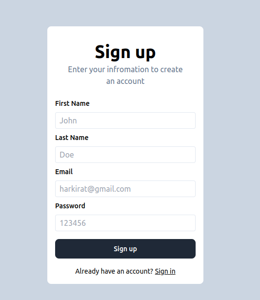
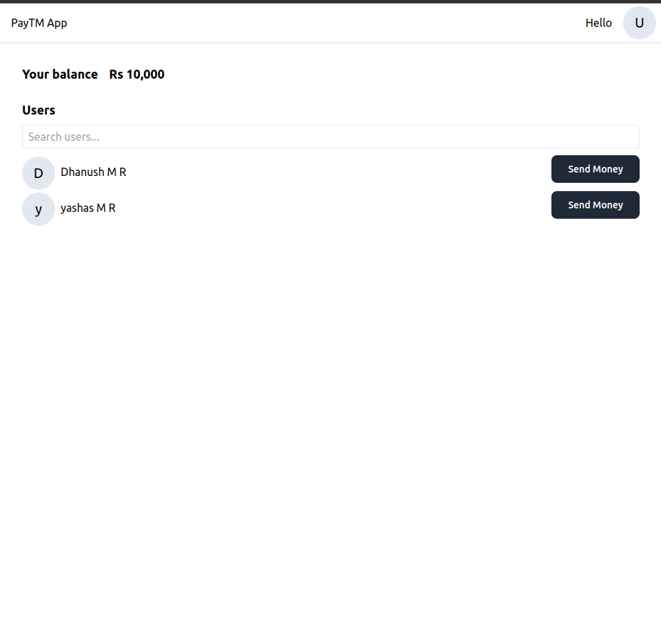

# Payment App Project

## Overview

This repository contains the source code for a Payment App built on the MERN (MongoDB, Express.js, React.js, Node.js) stack. The Payment App allows users to make and receive payments securely through a web-based platform.

## Features

- User authentication: Secure user authentication system to protect user accounts and transactions.
- Dashboard: A user-friendly dashboard for managing transactions, viewing payment history, and checking account balance.
- Payment Gateway Integration: Integration with a secure payment gateway for processing transactions.
- Real-time Updates: Utilizes real-time updates to provide users with instant transaction notifications.
- Responsive Design: A responsive and mobile-friendly user interface for seamless user experience across devices.
- 
## Getting Started

1. **Clone the repository:**

   ```bash
   git clone https://github.com/Dhanush0369/Payment_App
   cd Payment_App
   ```

2. **Install dependencies**

   ```bash
    cd frontend
    npm install
   
    cd ../backend
    npm install
   ```
3. **Start the backend server:**

   ```bash
   cd server
   npm start
   ```
4. **Start frontend:**

   ```bash
   cd client
   npm run dev
   ```
**Open your browser and navigate to http://localhost:3000/signup to access the Payment App.**

## Screenshots
<h3 align="center">Sign up design</h3>
<p align="center"> </p>
<br/>
<h3 align="center">Dashboard</h3>
<p align="center"> </p>


